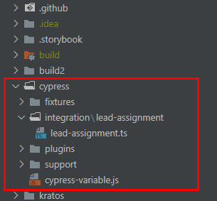
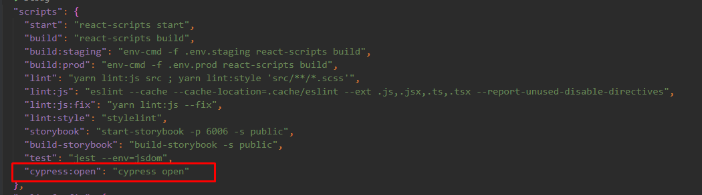
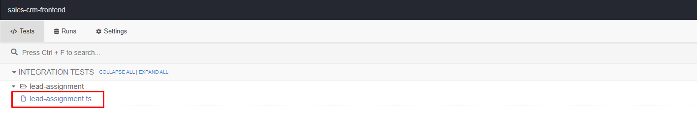

# Material App Pro - React Admin & Dashboard Template

This project was bootstrapped with [Create React App](https://github.com/facebook/create-react-app).

## Prerequisites

1. NodeJS
You'll need to have Node 12.0.0 or up. We recommend upgrading to the LTS version of NodeJS available at [https://nodejs.org/](https://nodejs.org/). 

You can also use [nvm](https://github.com/creationix/nvm#installation) (macOS/Linux) or [nvm-windows](https://github.com/coreybutler/nvm-windows#node-version-manager-nvm-for-windows) to switch Node versions between different projects.

2. Docker [https://www.docker.com/products/docker-desktop]
## Quick Start

Install packages and dependencies from `package.json`

`$ yarn install`

### Create environment variable file
create .env file by copy it from .env.example
### Start the app

 `$ yarn start`

Runs the app in the development mode.
Open [http://localhost:3000](http://localhost:3000) to view it in the browser.

The page will reload if you make edits.
You will also see any lint errors in the console.

### Build the app

 `$ yarn run build`

Builds the app for production to the `build` folder.
It correctly bundles React in production mode and optimizes the build for the best performance.

The build is minified and the filenames include the hashes.
Your app is ready to be deployed!

See the section about [deployment](https://facebook.github.io/create-react-app/docs/deployment) for more information.

## Cypress.io Test

Read document of cypress.io on website [cypress document](https://docs.cypress.io/)

To run cypress you have to create a `cypress.env.json` file with following values:
    {
    "username": "your username",
    "password": "your password"
    }

NOTE: Can use the admin username and password of salesCRM

### Folder of cypress:

### How to run Cypress:

1. Run docker container

2. Go to the kratos map by executing the command 
`$cd kratos`

3. Run following command
`$ docker-compose up`
`$ cd ..`

4. Run the app
`$ yarn start`

5. Run the cypress tests
`$ yarn cypress:open`

## Learn More

You can learn more in the [Create React App documentation](https://facebook.github.io/create-react-app/docs/getting-started).

To learn React, check out the [React documentation](https://reactjs.org/).